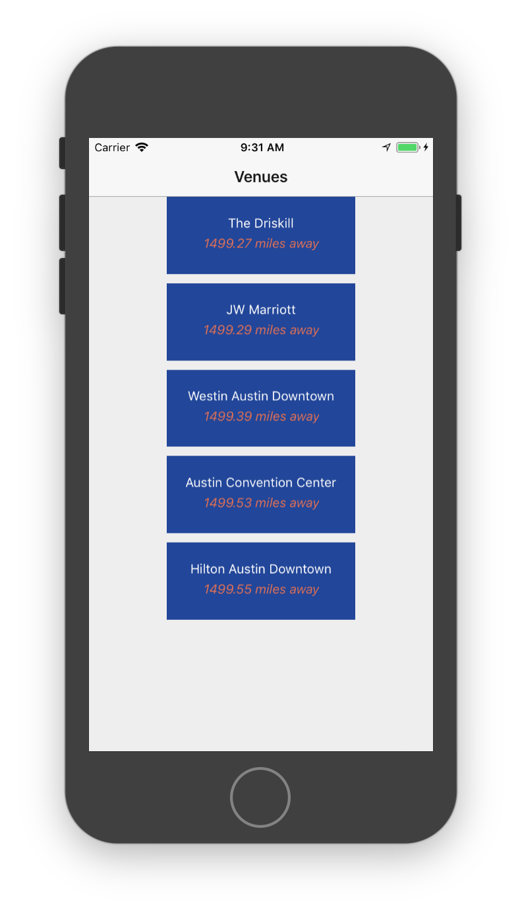
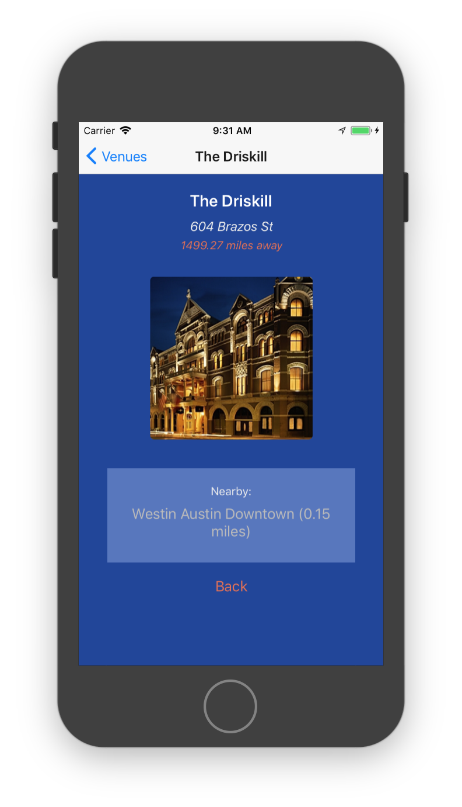

## Learning React Native
Six challenges to get you started with React Native, [source](https://share.viget.com/sxsw/learning-react-native/index.html). Credit to [Lawson Kurtz](https://gitlab.com/ltk).

#### [Challenge 6: Location](https://share.viget.com/sxsw/learning-react-native/lessons/6-location/index.html)
Building on top of what you already made in Challenge 5, enhance your venue list by showing in real-time how far away the user is from each venue.

#### The Geolocation API
In addition to location-oriented components like `<MapView>`, React Native provides a [Geolocation API](https://developer.mozilla.org/en-US/docs/Web/API/Geolocation). This API lets you do perform more advanced, non-map based activity based on location.

Using this API, you can get a user’s current position `(getCurrentPosition)`, subscribe to updates of the user’s position `(watchPosition)`, and clear the aforementioned subscription `(clearWatch)`.

Geolocation functions are available through the `navigator.geolocation` global, so you don’t need to import anything. A simple example:
```js
componentDidMount() {
  const positionOptions = {
    enableHighAccuracy: true,
    timeout: 10000,
    maximumAge: 1000
  }

  const onSuccess = (position) => {
    // on successful retrieval of a position, this function will execute
    this.setState({ position })
  }

  const onFailure = (error) => {
    // on a failed attempt to get a position, this function will execute
    alert(error)
  }

  navigator.geolocation.getCurrentPosition(onSuccess, onFailure, positionOptions)
}
```

#### `HomeScreen` component:


#### `DetailsScreen` component:


#### [Return to README](../README.md#learning_react_native)
