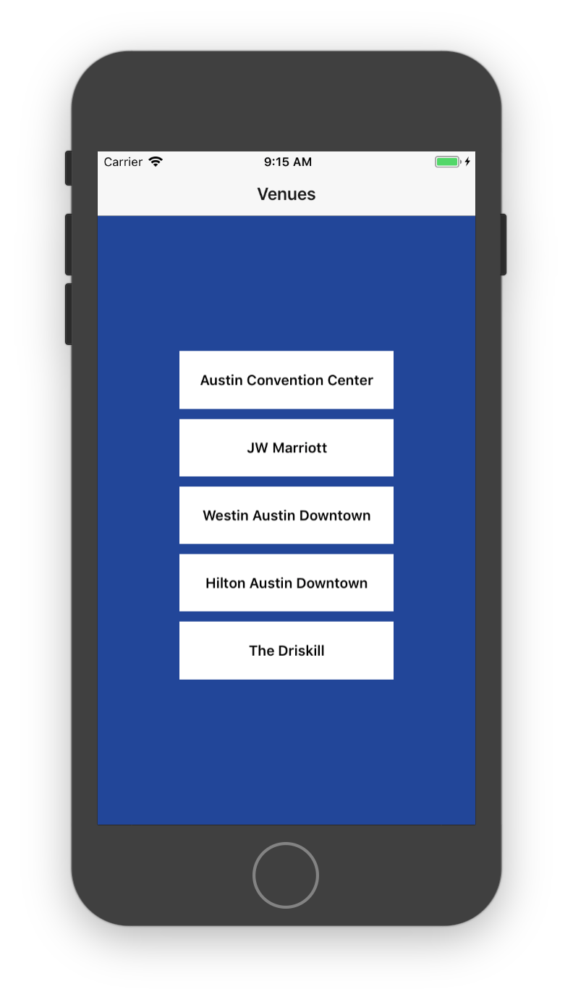
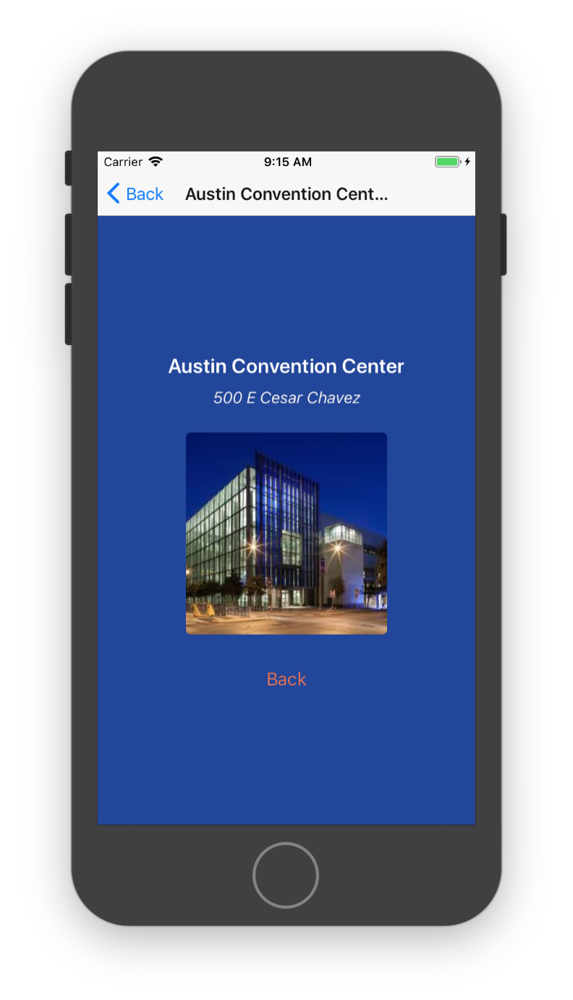

## Learning React Native
Six challenges to get you started with React Native, [source](https://share.viget.com/sxsw/learning-react-native/index.html). Credit to [Lawson Kurtz](https://gitlab.com/ltk).

#### [Challenge 5: Navigation](https://share.viget.com/sxsw/learning-react-native/lessons/5-navigation/index.html)
Build an app that provides details about some popular venues, using [react-navigation](https://reactnavigation.org/) library.

#### React Navigation
React Navigation is built around the concept of the navigation stack. You can think of this stack as similar to a browser’s history. As you visit a new page, you add the page to the top of the stack. When you go back, you simply pop the top page off of the stack and return to the page below it in line.

All we need to get started using React Navigation is a function called `createStackNavigator`.

#### Creating a stack navigator
`createStackNavigator` is a function that returns a React component. It takes a route configuration object and, optionally, an options object. Because the `createStackNavigator` function returns a React component, we can export it directly from App.js to be used as our App's root component.
```js
// In App.js in a new project
import React from 'react';
import { View, Text } from 'react-native';
import { createStackNavigator } from 'react-navigation';

class HomeScreen extends React.Component {
  render() {
    return (
      <View style={{ flex: 1, alignItems: 'center', justifyContent: 'center' }}>
        <Text>Home Screen</Text>
      </View>
    );
  }
}

export default createStackNavigator({
  Home: {
    screen: HomeScreen
  },
});
```

#### `HomeScreen` component:


#### `DetailsScreen` component:


#### [Challenge 6: Location](./Location.md)

#### [Return to README](../README.md#learning_react_native)
