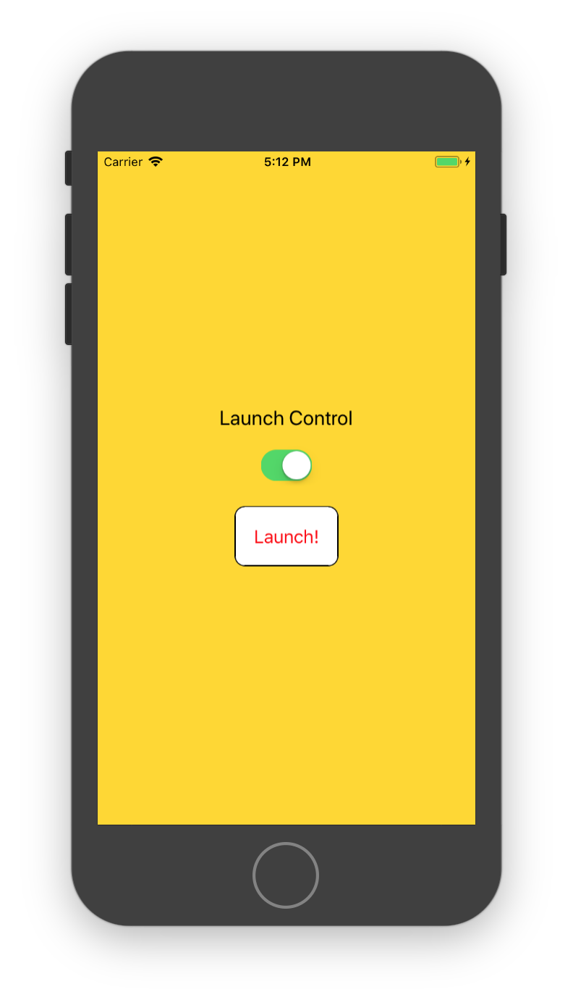

## Learning React Native
Six challenges to get you started with React Native, [source](https://share.viget.com/sxsw/learning-react-native/index.html). Credit to [Lawson Kurtz](https://gitlab.com/ltk).

#### [Challenge 4: Rockets](https://share.viget.com/sxsw/learning-react-native/lessons/4-rockets/index.html)
Make an app with a button that fires a rocket. The button should have some sort of safety to prevent accidental launches.

<b>Buttons & Touchables:</b> React Native includes a number of component types specifically designed to handle touch interactions. These include:
```html
<Button>
<TouchableHighlight>
<TouchableOpacity>
<TouchableWithoutFeedback>
```
All these components take a onPress prop for an interaction even handler.



#### [Challenge 5: Navigation](./Navigation.md)

#### [Return to README](../README.md#learning_react_native)
