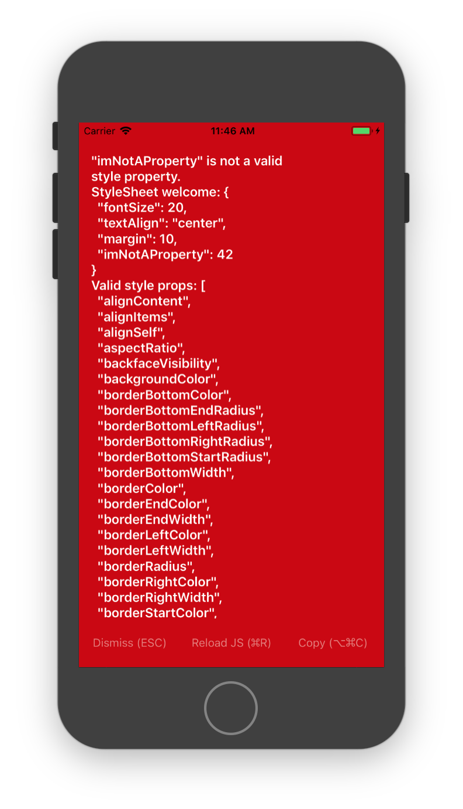
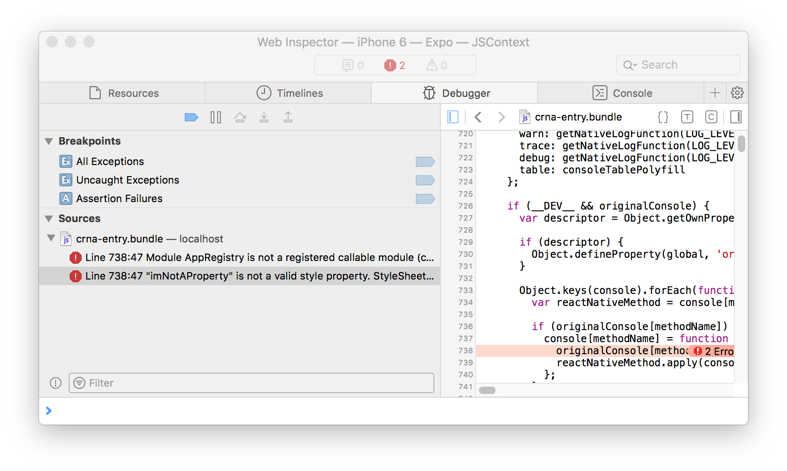
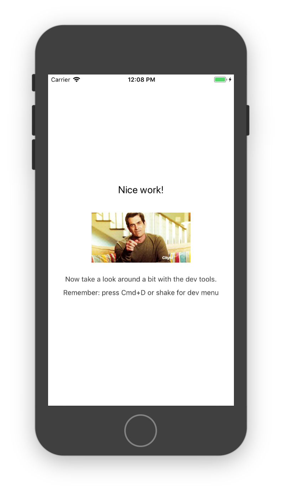

## Learning React Native
Six challenges to get you started with React Native, [source](https://share.viget.com/sxsw/learning-react-native/index.html). Credit to [Lawson Kurtz](https://gitlab.com/ltk).

#### [Challenge 2: Simulator Orientation](https://share.viget.com/sxsw/learning-react-native/lessons/2-simulator-orientation/index.html)
The goal of this challenge it to become comfortable with light debugging and the basic React Native dev tools. You’ll debug some errors, and then spend some time poking around the dev tools.

<b>Use the Safari Web Inspector to debug the page in iOS Simulator</b>
1. In the Safari on your Mac, on the Safari menu bar, choose the "Develop" menu.
2. Scroll to the iOS Simulator option.
3. Select the page for debugging.
4. Preview on Simulator

#### [Challenge 3: Straight Styling](./Straight_Styling.md)

#### [Return to README](../README.md#learning_react_native)
