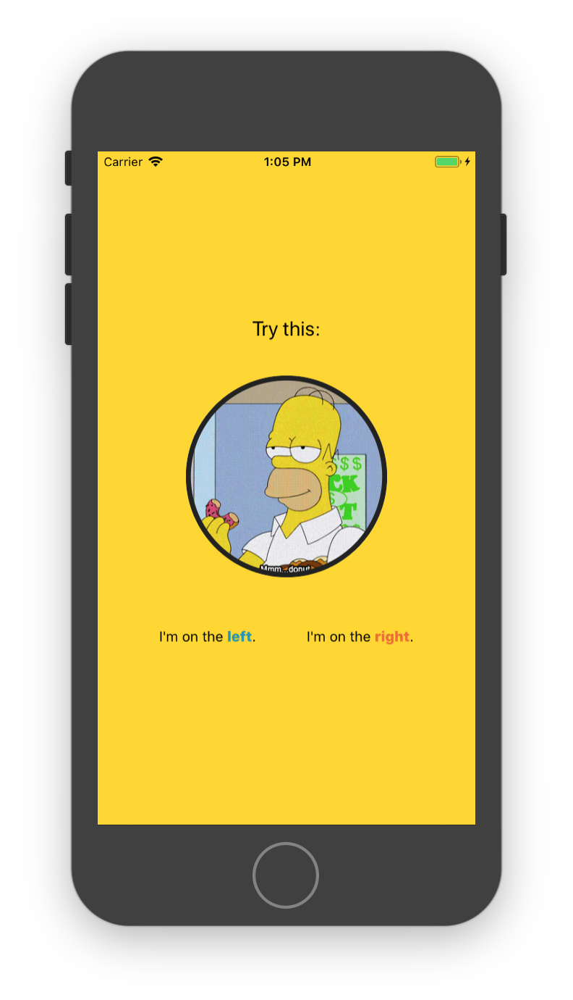

## Learning React Native
Six challenges to get you started with React Native, [source](https://share.viget.com/sxsw/learning-react-native/index.html). Credit to [Lawson Kurtz](https://gitlab.com/ltk).

#### [Challenge 3: Straight Styling](https://share.viget.com/sxsw/learning-react-native/lessons/3-straight-styling/index.html)
The goal with this challenge is to gain familiarity with React Native’s style and layout capabilities.

<b>Intro to Pseudo-CSS:</b> React Native does not implement CSS, however it uses JavaScript-based tooling this is inspired by and feels very much like CSS in certain ways.

Styles are represented as JSON.
```css
.page {
  background-color: orange;
  height: 42px;
  border: 1px solid blue;
}
```
…would be…
```js
{
  page: {
    backgroundColor: 'orange',
    height: 42,
    borderColor: 'blue',
    borderWidth: 1
  }
}
```
Note; `<View>` is analogous to HTML’s `<div>`, `<Text>` is analogous to `<p>`, and `<Image>` is analogous to ``.



#### [Challenge 4: Rockets](./Rockets.md)

#### [Return to README](../README.md#learning_react_native)
