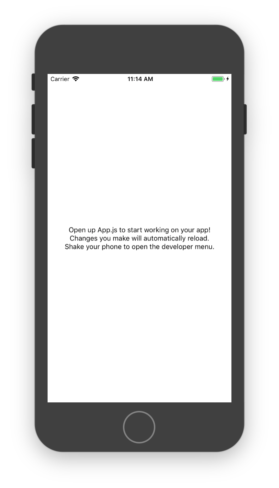

## Learning React Native
Six challenges to get you started with React Native, [source](https://share.viget.com/sxsw/learning-react-native/index.html). Credit to [Lawson Kurtz](https://gitlab.com/ltk).

#### [Challenge 1: Zero to Hero](https://share.viget.com/sxsw/learning-react-native/lessons/1-zero-to-hero/index.html)
The goal of this challenge it to initialize your first React Native app, and get it running on a device using Expo.
```bash
npm start
11:11:38: Starting iOS...

 › Press a to open Android device or emulator, or i to open iOS emulator.
 › Press q to display QR code.
 › Press r to restart packager, or R to restart packager and clear cache.
 › Press d to toggle development mode. (current mode: development)

Building JavaScript bundle [==============================================] 56%
```


#### [Challenge 2: Simulator Orientation](./Simulator_Orientation.md)

#### [Return to README](../README.md#learning_react_native)
